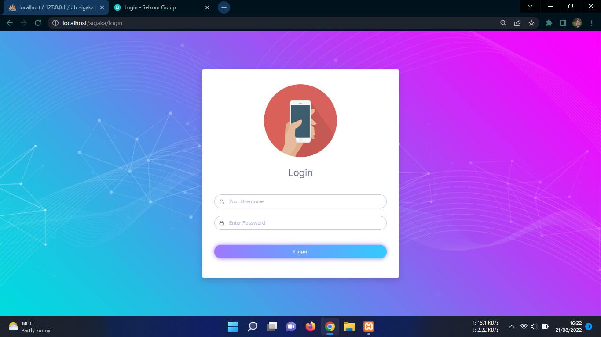
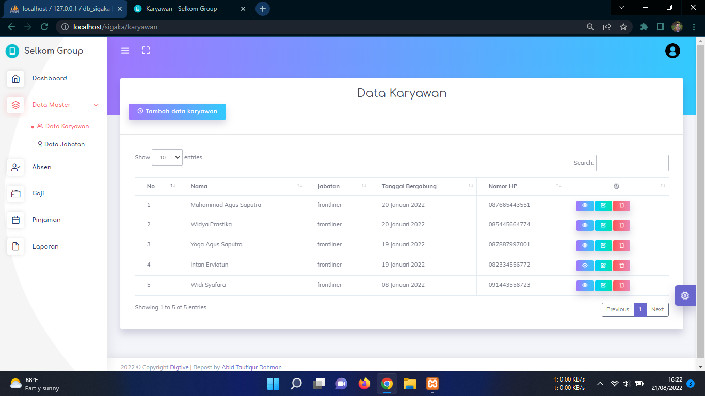
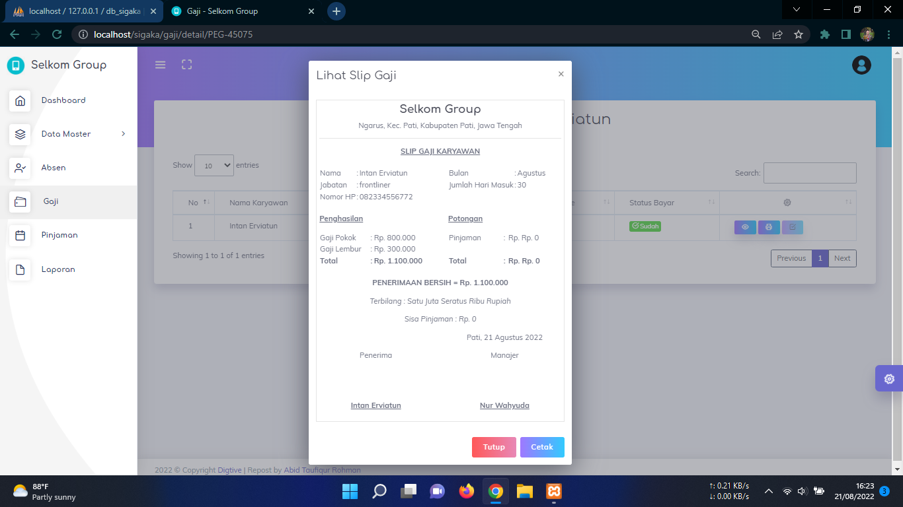
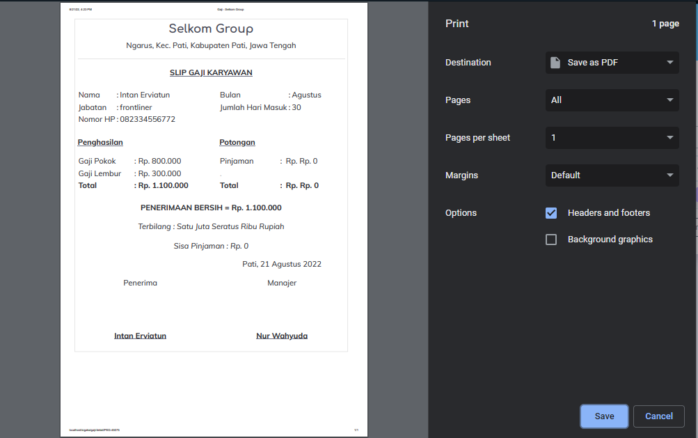

# Sistem Informasi Gaji Karyawan
Aplikasi sistem informasi gaji karyawan berbasis web dengan menggunakan framework CodeIgniter

## Tampilan Aplikasi

## Login Aplikasi
| Username | Password |
|:--------:|---------:|
|  admin   |  admin   |

## Fitur Aplikasi :
- Halaman FrontEnd
- Login Admin
- Data Karyawan
- Data Jabatan
- Data Absen
- Data Gaji
- Data Pinjaman
- Data Laporan
- Logout
